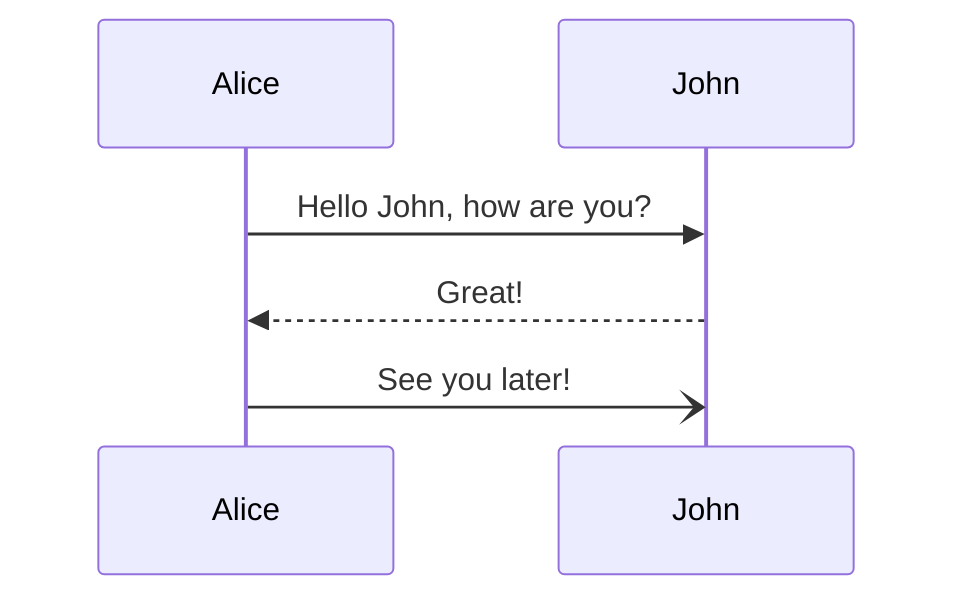
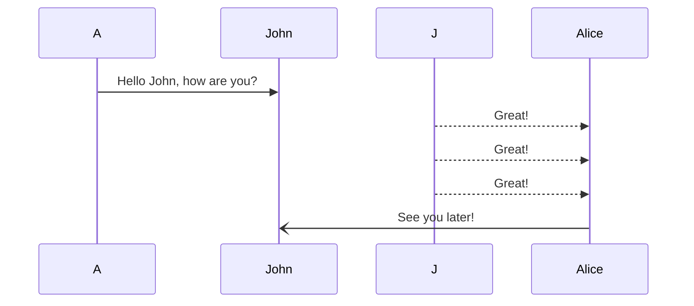

# Hello

This is a diagram?

Oh what now now

```mermaid
sequenceDiagram
    Alice->>John: Hello John, how are you?
    John-->>Alice: Great!
    Alice-)John: See you later!
```
And another?

```mermaid
sequenceDiagram
    A->>John: Hello John, how are you?
    J-->>Alice: Great!
    J-->>Alice: Great!
    J-->>Alice: Great!
    Alice-)John: See you later!
```
