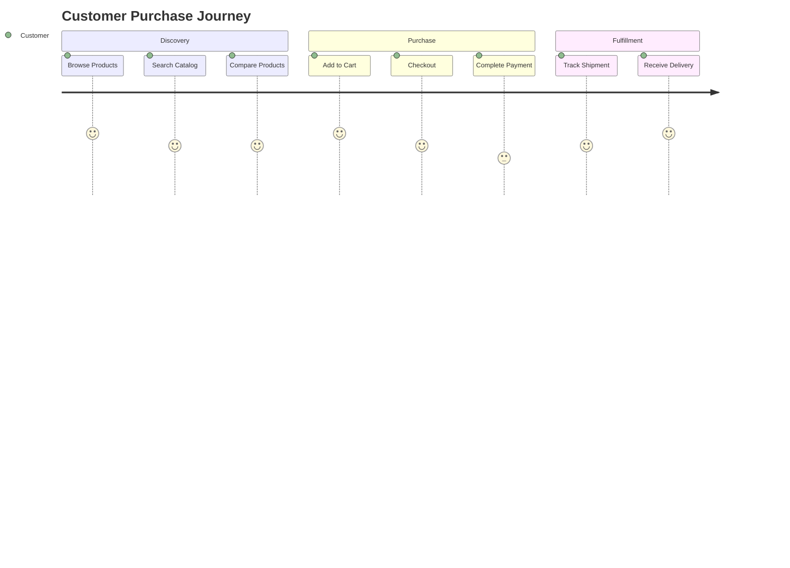
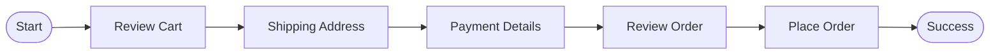

# Page 2 — User Journey and Business Context

> Understanding how customers interact with a digital commerce platform is essential for both technical and business success.

---

## Understanding the Customer Experience

The customer journey is one of the most important aspects of any digital commerce platform. While the underlying technology may be highly sophisticated, the success of the system is ultimately determined by how easily customers can discover products, compare alternatives, complete purchases, and receive their orders.

Research consistently demonstrates that users expect a streamlined experience with minimal friction. Every additional step in the checkout process introduces the possibility of abandonment.

> **Key Insight:** Reducing friction in the customer journey directly improves conversion rates and customer satisfaction.

For this reason, the platform architecture has been designed around:

- Reducing latency
- Minimizing unnecessary interactions
- Ensuring high availability
- Supporting peak-demand traffic
- Improving operational visibility

### Customer Journey Phases

The customer experience can be divided into three major phases:

1. **Product Discovery and Evaluation**
2. **Purchase and Payment Processing**
3. **Fulfillment, Tracking, and Post-Purchase Support**

Each phase requires coordination among multiple backend services while maintaining a seamless user interface.

#### Customer Activities

| Phase | Activities | Goal |
|---------|------------|---------|
| Discovery | Browse, Search, Compare | Find suitable products |
| Purchase | Cart, Checkout, Payment | Complete transaction |
| Fulfillment | Shipping, Tracking, Support | Receive and manage order |

##### Customer Perspective Diagram



###### Summary

The customer journey spans multiple business and technical processes while appearing as a single cohesive experience to the user.

---

## Business Considerations

From a business perspective, every interaction within the customer journey generates valuable operational data.

Examples include:

- 🔍 Search queries reveal purchasing intent.
- 🛒 Cart additions indicate product interest.
- 💳 Completed purchases contribute to revenue metrics.
- 📦 Delivery events measure fulfillment performance.

By capturing these events in a structured manner, organizations can:

- Improve forecasting accuracy
- Optimize inventory levels
- Enhance marketing effectiveness
- Measure customer engagement
- Support data-driven decision making

### Analytics Benefits

Analytics collected during these stages provide insights into user behavior patterns.

**Common business questions include:**

- Where do customers abandon checkout?
- Which promotions generate the highest conversion rates?
- What products show seasonal demand patterns?
- Which customer segments drive the most revenue?

> Analytics transforms raw operational events into actionable business intelligence.

### Architecture Support

The architecture incorporates:

| Capability | Purpose |
|------------|---------|
| Telemetry Collection | Capture operational metrics |
| Event Streaming | Process real-time business events |
| Centralized Analytics | Support reporting and forecasting |
| Monitoring | Improve system visibility |
| Dashboards | Enable stakeholder insights |

---

## Checkout Process Details

The checkout process represents one of the most sensitive areas of the platform because it directly influences conversion rates and revenue generation.

### Design Objectives

The workflow must balance:

| Security | Usability |
|-----------|-----------|
| Fraud prevention | Fast checkout |
| Data validation | Minimal friction |
| Payment protection | Simplicity |
| Compliance requirements | Customer convenience |

### Checkout Workflow



### Validation Stages

1. Cart validation
2. Address verification
3. Payment authorization
4. Order review
5. Order confirmation

> Proper validation reduces failed transactions while maintaining a smooth user experience.

---

## Future Enhancements (TODO?)

> **Status:** Planned for future releases.

Several improvements are planned for future releases of the platform.

### Planned Features

- [ ] AI-assisted product recommendations
- [ ] Personalized search ranking
- [ ] Automated customer support integration
- [ ] Predictive inventory management
- [ ] Advanced customer segmentation
- [ ] Real-time recommendation engines

### Expected Benefits

| Enhancement | Expected Outcome |
|-------------|------------------|
| AI Recommendations | Increased conversion rates |
| Personalized Search | Improved product discovery |
| Customer Support Automation | Faster issue resolution |
| Predictive Inventory | Reduced stock shortages |

### Incremental Delivery Approach

The modular nature of the platform ensures that new capabilities can be introduced incrementally.

Benefits include:

- Reduced deployment risk
- Faster feedback cycles
- Easier rollback procedures
- Better business validation
- Improved scalability

---

## Documentation and Governance

As the platform evolves, maintaining clear documentation and architecture diagrams remains essential.

### Primary Objectives

1. Onboard new engineers efficiently.
2. Support operational teams.
3. Maintain architectural consistency.
4. Improve stakeholder communication.
5. Align business and technical goals.

### Key Success Factors

> Continuous documentation, observability, and architectural discipline are critical to long-term platform success.

---

### References

| Topic | Relevance |
|---------|------------|
| Customer Experience | User satisfaction and retention |
| Analytics | Business intelligence |
| Checkout Optimization | Revenue generation |
| Platform Architecture | Scalability and reliability |
| Future Enhancements | Innovation and growth |

---

**Keywords:** `customer journey`, `checkout`, `analytics`, `telemetry`, `event streaming`, `business intelligence`, `e-commerce`, `platform architecture`, `customer experience`, `fulfillment`


### Example Event Payload

The platform captures customer interactions as structured events.

```json
{
  "eventType": "cart_item_added",
  "customerId": "12345",
  "productId": "SKU-001",
  "timestamp": "2026-06-06T12:30:00Z"
}
```

These events are published to an `event-stream` and later consumed by analytics services.

### Sample Telemetry Query

Operations teams may execute queries such as:

```sql
SELECT COUNT(*)
FROM checkout_events
WHERE status = 'completed'
  AND event_date = CURRENT_DATE;
```

The query helps measure daily checkout completion rates.

### Configuration Example

A service may be configured using a file such as:

```yaml
telemetry:
  enabled: true
  samplingRate: 100

analytics:
  endpoint: analytics.company.internal
```

### Common Technical Terms

The architecture relies on components such as:

- `API Gateway`
- `Checkout Service`
- `Payment Processor`
- `Event Bus`
- `Analytics Pipeline`
- `Inventory Service`

Customer actions generate events like:

- `product_viewed`
- `search_performed`
- `cart_item_added`
- `checkout_started`
- `payment_completed`
- `order_fulfilled`

### Monitoring Notes

Engineers often track metrics such as:

- `request_latency_ms`
- `error_rate`
- `checkout_conversion_rate`
- `orders_per_minute`

A typical alert might trigger when `error_rate > 5%`.

> Example: If `checkout_conversion_rate` drops significantly after a deployment, teams can investigate potential regressions.
